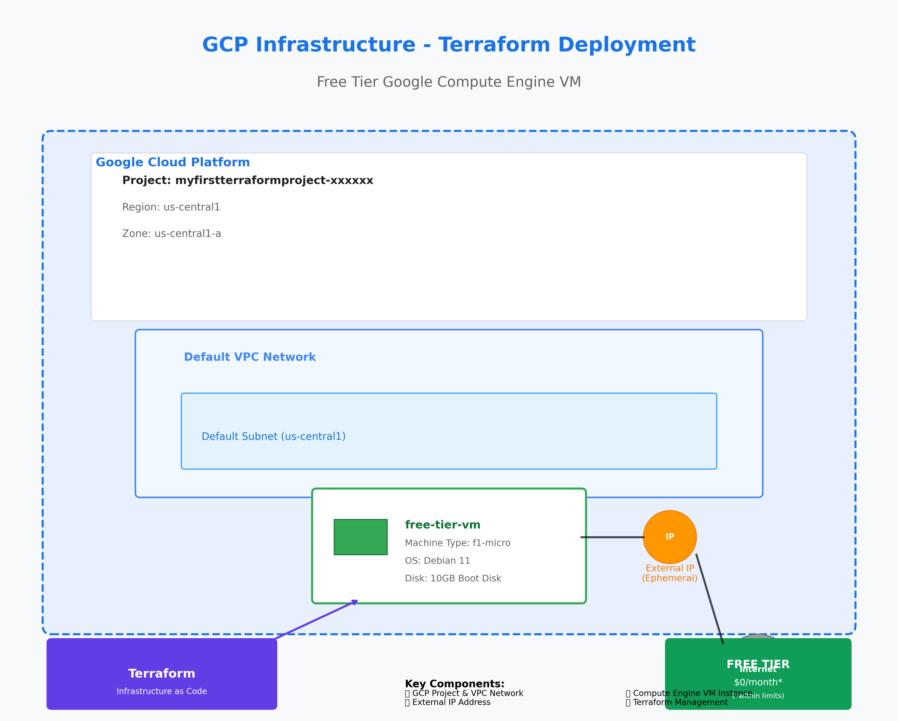

# My First Terraform Project

This project demonstrates Infrastructure as Code (IaC) using Terraform to deploy a free-tier Google Compute Engine virtual machine on Google Cloud Platform (GCP).

## Project Structure

```
MyFirstTerraformProject/
├── README.md                                    # This file - project documentation
├── myfirstterraformproject-465520-5de4ddb88664.json  # GCP service account key (keep secure!)
└── iac/                                        # Infrastructure as Code directory
    ├── main.tf                                 # Main Terraform configuration
    ├── variables.tf                            # Variable definitions
    └── terraform.tfvars                        # Variable values (your specific settings)
```

## What This Project Creates



- **1x Google Compute Engine VM**: A free-tier `f1-micro` instance running Debian 11
- **Network Configuration**: VM attached to default VPC with external IP access
- **Cost**: Free (within GCP free tier limits)

## Prerequisites

Before you begin, ensure you have:

1. **Google Cloud Platform Account**
   - Active GCP account with billing enabled
   - A GCP project created

2. **Terraform Installed**
   - Download from [terraform.io](https://www.terraform.io/downloads.html)
   - Version 1.3.0 or higher required

3. **GCP Service Account**
   - Service account with Compute Engine permissions
   - Downloaded JSON key file

## Setup Instructions

### Step 1: Install Terraform

#### Windows (using Chocolatey):
```powershell
choco install terraform
```

#### Windows (manual installation):
1. Download Terraform from [terraform.io](https://www.terraform.io/downloads.html)
2. Extract to a directory (e.g., `C:\terraform`)
3. Add the directory to your system PATH
4. Verify installation: `terraform --version`

### Step 2: Set Up Google Cloud Project

1. **Create a GCP Project** (if you haven't already):
   - Go to [Google Cloud Console](https://console.cloud.google.com/)
   - Create a new project or select existing one
   - Note your Project ID

2. **Enable Required APIs**:
   ```bash
   gcloud services enable compute.googleapis.com
   ```

3. **Create Service Account**:
   - Go to IAM & Admin > Service Accounts
   - Click "Create Service Account"
   - Name: `terraform-sa`
   - Grant role: `Compute Engine Admin`
   - Create and download JSON key file

### Step 3: Configure the Project

1. **Update terraform.tfvars**:
   ```terraform
   project_id       = "your-actual-project-id"
   region           = "us-central1"
   zone             = "us-central1-a"
   credentials_file = "path/to/your/service-account-key.json"
   ```

2. **Secure Your Credentials**:
   - Keep the JSON key file secure
   - Never commit it to version control
   - Consider using environment variables for production

### Step 4: Deploy Infrastructure

1. **Navigate to the iac directory**:
   ```powershell
   cd C:\Users\bryan\Documents\MyFirstTerraformProject\iac
   ```

2. **Initialize Terraform**:
   ```powershell
   terraform init
   ```
   This downloads the Google Cloud provider and sets up the working directory.

3. **Plan the deployment** (optional but recommended):
   ```powershell
   terraform plan
   ```
   This shows what resources will be created without actually creating them.

4. **Apply the configuration**:
   ```powershell
   terraform apply
   ```
   Type `yes` when prompted to confirm the deployment.

5. **Verify deployment**:
   - Check the Google Cloud Console
   - Look for your VM instance named "free-tier-vm"

## Managing Your Infrastructure

### View Current State
```powershell
terraform show
```

### Update Infrastructure
1. Modify the `.tf` files as needed
2. Run `terraform plan` to preview changes
3. Run `terraform apply` to apply changes

### Destroy Infrastructure
```powershell
terraform destroy
```
**⚠️ Warning**: This will permanently delete all resources created by this configuration.

## Connecting to Your VM

Once deployed, you can connect to your VM:

1. **Via SSH from Cloud Console**:
   - Go to Compute Engine > VM instances
   - Click "SSH" next to your instance

2. **Via gcloud CLI**:
   ```bash
   gcloud compute ssh free-tier-vm --zone=us-central1-a
   ```

## File Explanations

### `main.tf`
- **Terraform Block**: Specifies provider requirements and minimum Terraform version
- **Provider Block**: Configures authentication and default settings for Google Cloud
- **Resource Block**: Defines the VM instance with its specifications

### `variables.tf`
- Defines input variables with types and descriptions
- Provides default values where appropriate
- Makes the configuration reusable and customizable

### `terraform.tfvars`
- Contains actual values for the variables
- Specific to your GCP project and preferences
- Should not be committed to public repositories (contains sensitive paths)

## Security Best Practices

1. **Never commit credentials**: Add `*.json` and `terraform.tfvars` to `.gitignore`
2. **Use IAM roles**: Grant minimal required permissions to service accounts
3. **Regular audits**: Review and rotate service account keys regularly
4. **State file security**: Consider remote state storage for team projects

## Troubleshooting

### Common Issues

1. **Authentication errors**:
   - Verify service account key path is correct
   - Ensure service account has necessary permissions

2. **Quota exceeded**:
   - Check GCP quotas in the console
   - Ensure you're within free tier limits

3. **Region/zone issues**:
   - Verify the region/zone supports f1-micro instances
   - Check if the zone is available in your project

### Getting Help

- **Terraform Documentation**: [terraform.io/docs](https://www.terraform.io/docs)
- **Google Cloud Provider**: [registry.terraform.io/providers/hashicorp/google](https://registry.terraform.io/providers/hashicorp/google/latest/docs)
- **GCP Free Tier**: [cloud.google.com/free](https://cloud.google.com/free)

## Next Steps

Consider expanding this project by adding:
- **Outputs**: Display VM external IP and connection info
- **Firewall rules**: Custom networking and security
- **Cloud Storage**: Persistent storage solutions
- **Load balancing**: Multiple instances with distribution
- **Monitoring**: Cloud monitoring and alerting

---

**Happy Terraforming! 🚀**
